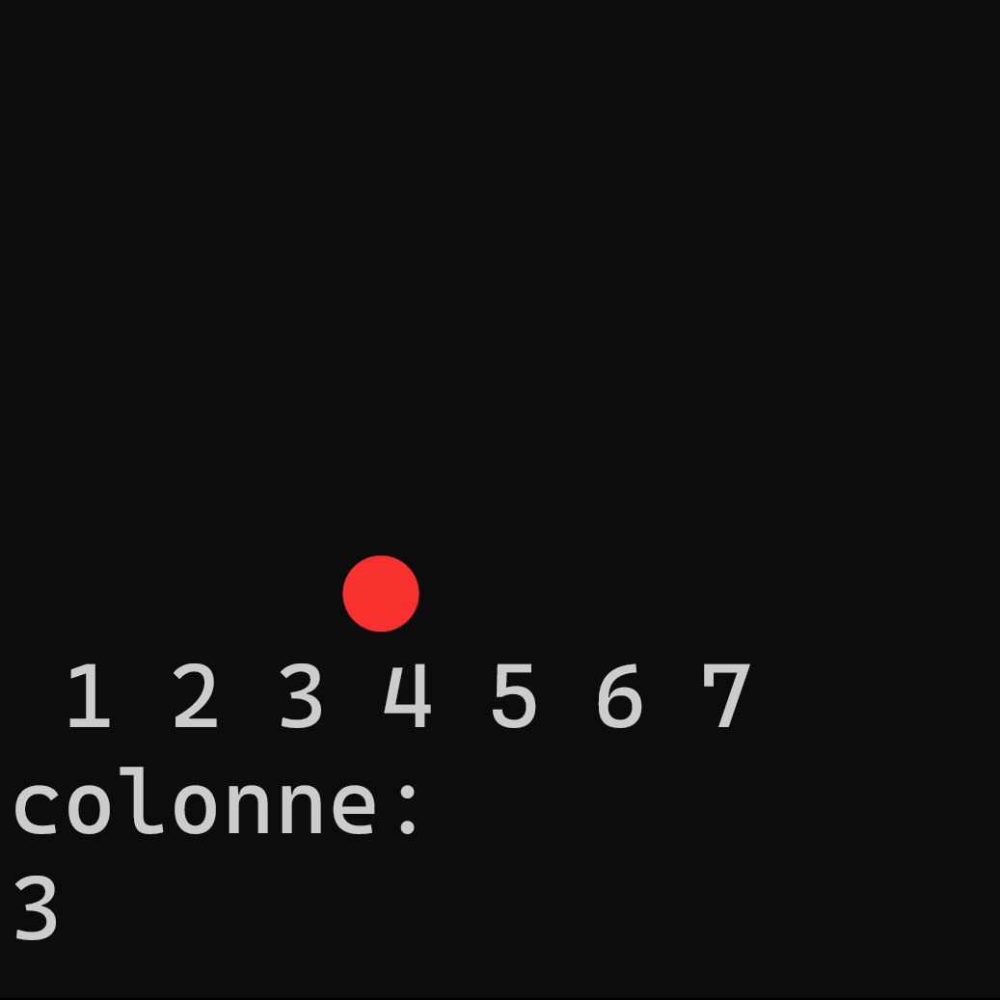

# Pyssance 4

    

**Pyssance** est un jeu en ligne de commande du Puissance 4 fait en python.

## Téléchargement

- 🟢 **[Dernière version](https://github.com/Pietot/Da3dsoul.dev-Downloader/releases/latest)**

## Comment jouer ?

Une fois le programme lancé, simplement indiquer la colonne ou vous voulez placer votre jeton. Vous êtes les jaunes, l'ordinateur les rouges. Il faut aligner 4 jetons horizontalement ou verticalement ou diagonnalement pour gagner !

